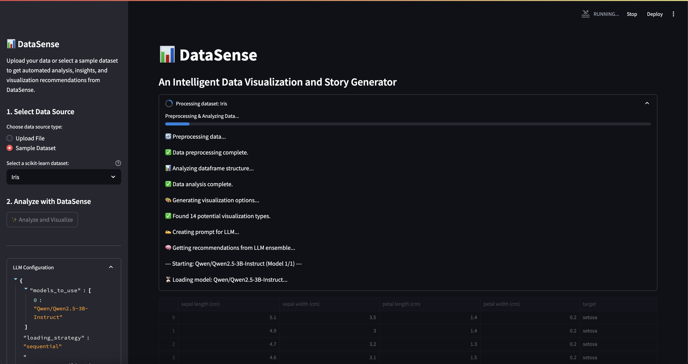

# 📊 DataSense: Transform Raw Data into Beautiful Visualizations & Stories

[](https://www.python.org/)
[](https://opensource.org/licenses/MIT)
[](https://your-streamlit-app-url.com)
[](https://vllm.ai/)
[](https://plotly.com/)

> **Tired of manually exploring data and struggling to find the right visualization? Let DataSense do the heavy lifting!**

DataSense harnesses the collective intelligence of multiple Large Language Models to automatically analyze your datasets, recommend the most impactful visualizations, and generate compelling data narratives—all in a sleek, easy-to-use interface.



## 🌟 Why DataSense?

Most data visualization tools make YOU do the work of deciding which charts to use. DataSense flips this model by:

- **Analyzing your data automatically** - understanding relationships, patterns, and outliers
- **Recommending the best visualizations** - using an ensemble of LLMs to vote on the most insightful chart types
- **Generating explanatory narratives** - creating readable stories that explain what your data means
- **Requiring zero coding** - just upload your data and click "Analyze"

Perfect for data scientists, business analysts, students, researchers, and anyone who works with data!

## ✨ Key Features

### 🔄 Flexible Data Input
```
# Supported file formats:
✓ CSV files
✓ JSON documents 
✓ Text files
✓ Built-in scikit-learn datasets
```

### 🧠 LLM-Powered Intelligence
```python
# Behind the scenes, DataSense uses a configurable ensemble of LLMs:
llm_settings:
  models_to_use:
    - "meta-llama/Llama-3.1-8B-Instruct"
    - "Qwen/Qwen2.5-7B-Instruct"
    - "microsoft/phi-3-mini-128k-instruct"
  loading_strategy: "sequential"  # or "concurrent" for high-VRAM systems
  sampling_params:
    temperature: 0.1
    top_p: 0.95
    max_tokens: 4096
    n: 3  # Number of samples per model for pass@k
```

### 📈 Smart Visualization Selection
DataSense doesn't just show a single visualization—it presents the **top 3 recommended chart types** based on LLM consensus voting, then automatically generates the winning visualization using Plotly.

### 📝 Automatic Data Storytelling
Each visualization comes with:
- **Data Insights** - Key statistical findings and patterns
- **Data Story** - A narrative explanation that makes complex relationships understandable

### 🔍 Manual Exploration
Want to try a different chart type? The "Manual Visualization Explorer" lets you select and generate any suitable visualization identified during analysis.

## 🚀 Quick Start

### Installation

```bash
# Clone the repository
git clone https://github.com/ctrl-gaurav/DataSense.git
cd DataSense

# Create a virtual environment
python -m venv venv
source venv/bin/activate  # On Windows: venv\Scripts\activate

# Install dependencies
pip install -r requirements.txt
```

### Running DataSense

```bash
# Launch the Streamlit app
streamlit run app.py
```

Navigate to the URL provided by Streamlit (typically http://localhost:8501).

### Using DataSense in 3 Simple Steps

1. **Choose Your Data**:
   - Upload a CSV, JSON, or TXT file
   - Or select from the built-in sample datasets

2. **Analyze Your Data**:
   - Click the "✨ Analyze and Visualize" button
   - Watch as DataSense processes your information

3. **Explore the Results**:
   - View the top visualization recommendations
   - Read the auto-generated data story
   - Try different chart types in the Manual Explorer

## ⚙️ Configuration Options

DataSense is highly configurable via the `config.yaml` file:

```yaml
# Key configuration options
llm_settings:
  # Models to include in your ensemble (must be compatible with vLLM)
  models_to_use:
    - "meta-llama/Llama-3.1-8B-Instruct"
    - "Qwen/Qwen2.5-7B-Instruct" 
    - "microsoft/phi-3-mini-128k-instruct"
  
  # Choose loading strategy based on your hardware
  loading_strategy: "sequential"  # Less VRAM, loads one model at a time
  # loading_strategy: "concurrent"  # Faster, but requires more VRAM
  
  # GPU resource allocation
  gpu_memory_utilization_per_model: 0.85
  num_gpus: 1  # Tensor parallel size for vLLM
  
  # LLM generation parameters
  sampling_params:
    temperature: 0.1
    top_p: 0.95
    max_tokens: 4096
    n: 3  # Number of samples per model for pass@k

data_settings:
  # Data analysis parameters
  correlation_threshold: 0.7
  max_rows_preview: 5
  categorical_threshold: 10  # Max unique values to consider a column categorical
```

## 💻 Code Examples

### Loading and Processing Data

```python
# From utils.py - How DataSense loads different file types
def load_uploaded_file(uploaded_file):
    """Load data from an uploaded file based on its extension."""
    try:
        file_ext = uploaded_file.name.split('.')[-1].lower()
        
        if file_ext == 'csv':
            return pd.read_csv(uploaded_file)
        elif file_ext == 'json':
            return pd.read_json(uploaded_file)
        elif file_ext == 'txt':
            # Try to parse as CSV first, with flexible delimiter detection
            try:
                return pd.read_csv(uploaded_file, sep=None, engine='python')
            except:
                # Fall back to reading as plain text
                content = uploaded_file.getvalue().decode('utf-8')
                return pd.DataFrame({'text': [content]})
        else:
            raise ValueError(f"Unsupported file extension: .{file_ext}")
    except Exception as e:
        st.error(f"Error loading file: {e}")
        return None
```

### LLM Analysis Flow

```python
# Simplified version of the LLM processing flow
def process_dataframe(self, df, dataset_name, progress_bar=None):
    # Update progress
    if progress_bar: progress_bar.progress(0.1, text="Preprocessing data...")
    
    # Preprocess and analyze the data
    processed_df, metadata = self.preprocess_data(df)
    
    # Build a prompt based on the data analysis
    if progress_bar: progress_bar.progress(0.3, text="Building LLM prompt...")
    prompt = self.build_visualization_prompt(processed_df, metadata)
    
    # Generate responses from multiple LLMs
    if progress_bar: progress_bar.progress(0.4, text="Running LLM ensemble...")
    responses = self.generate_from_ensemble(prompt)
    
    # Analyze votes across all LLM responses
    if progress_bar: progress_bar.progress(0.7, text="Analyzing LLM recommendations...")
    votes, visualization_options = self.count_visualization_votes(responses)
    
    # Generate the final visualization and story
    if progress_bar: progress_bar.progress(0.8, text="Creating visualization & story...")
    top_viz = self.get_top_visualization(votes)
    story = self.generate_visualization_story(processed_df, top_viz, metadata)
    
    # Return comprehensive results
    return {
        "success": True,
        "processed_dataframe": processed_df,
        "metadata": metadata,
        "recommendation": {
            "visualization_type": top_viz,
            "story": story,
            "votes": votes
        },
        "visualization_options": visualization_options
    }
```

### Creating Visualizations

```python
# From visualizations.py - How DataSense creates visualizations
def create_visualization(df, viz_type, metadata, config):
    """Create a visualization based on the specified type and data."""
    try:
        # Handle different visualization types
        if viz_type == "Scatter Plot":
            return create_scatter_plot(df, metadata)
        elif viz_type == "Bar Chart":
            return create_bar_chart(df, metadata)
        elif viz_type == "Line Chart":
            return create_line_chart(df, metadata)
        elif viz_type == "Histogram":
            return create_histogram(df, metadata)
        elif viz_type == "Box Plot":
            return create_box_plot(df, metadata)
        elif viz_type == "Heatmap":
            return create_heatmap(df, metadata)
        elif viz_type == "Pie Chart":
            return create_pie_chart(df, metadata)
        elif viz_type == "Violin Plot":
            return create_violin_plot(df, metadata)
        elif viz_type == "3D Scatter":
            return create_3d_scatter(df, metadata)
        else:
            # Default to a table view if visualization type not supported
            return None
    except Exception as e:
        print(f"Error creating visualization: {e}")
        return None
```

## 🔧 Advanced Usage

### Customizing LLM Models

DataSense supports any LLM compatible with vLLM. To change which models are used:

1. Edit the `models_to_use` list in `config.yaml`
2. Ensure the models are available on Hugging Face and compatible with vLLM
3. If using large models, consider adjusting GPU memory settings

### GPU Optimization

For best performance on resource-constrained systems:

```yaml
llm_settings:
  # Sequential loading for systems with limited VRAM
  loading_strategy: "sequential"
  gpu_memory_utilization_per_model: 0.75
  num_gpus: 1
```

For high-performance systems with multiple GPUs:

```yaml
llm_settings:
  # Concurrent loading for faster processing
  loading_strategy: "concurrent"
  gpu_memory_utilization_per_model: 0.9
  num_gpus: 2  # Adjust based on available GPUs
```

## 🤝 Contributing

Contributions make the open-source community amazing! We welcome contributions of all kinds:

- **Bug Reports**: File issues through GitHub Issues
- **Feature Requests**: Share your ideas for new features
- **Code Contributions**: Submit PRs to help improve DataSense
- **Documentation**: Help improve explanations and examples

Please read our [Contributing Guidelines](CONTRIBUTING.md) before submitting PRs.

<!-- ## 👨‍💻 Development Team

DataSense is brought to you by a talented team of data scientists and AI engineers:

- **Gaurav Srivastava**
- **Aafiya Hussain**
- **Najibul Sarker**
- **Zaber Hakim** -->

## 📜 Citation

If you use DataSense in your research or work, please cite:

```bibtex
@software{DataSense2025,
  author = {Srivastava, Gaurav and Hussain, Aafiya and Sarker, Najibul and Hakim, Zaber},
  title = {{DataSense: An Intelligent Data Visualization and Story Generator}},
  year = {2025},
  publisher = {GitHub},
  journal = {GitHub repository},
  url = {https://github.com/ctrl-gaurav/DataSense}
}
```

## 📄 License

This project is licensed under the MIT License - see the [LICENSE](LICENSE) file for details.

---

<p align="center">
  <b>Ready to unleash the power of automated data visualization?</b><br>
  Star ⭐ the repository and follow us for updates!
</p>